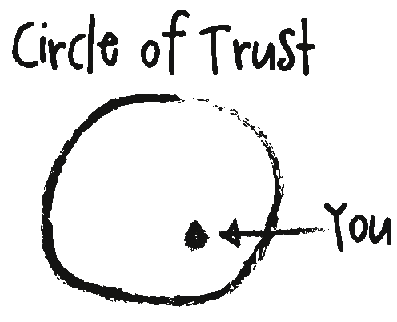
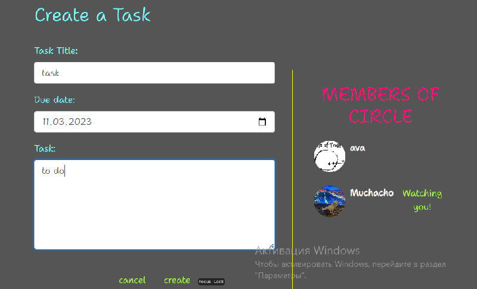

## CIRCLE OF TRUST (frontend)



---

- [The circle of Trust (frontend)](https://circle-of-trust-frontend.herokuapp.com/)
- [The circle of Trust (Backend)](https://circle-of-trust.herokuapp.com/)

### Circle of trust is a website, inspired by the movie "Meet the Fockers", for using by the trusted circle of people: family, friends, co-workers etc. This app helps to share memos and tasks in a secure and private environment. It is perfect for people who want to stay connected and organized. Instead of stickers, pinned to the fridge/whiteboard, or groupchats in whatsapp, you can use this app. 

## Project goals
The primary goals of the web app are to:
1) Provide busy families with a single, central hub around which to plan and organise busy schedules, ability to stay in touch with each other even long distance. This should include scheduling functionality similar to a family wall planner, sharing memos, viewed by all the members of the Circle.
2) Deliver a simple and intuitive user experience, suitable for all ages. 
3) Offer a minimal set of impactful features chosen in order to deliver a useful and entertaining app within an achievable development timeframe, while laying a foundation for additional features in the future.

## User Experience (UX) and Agile method

GitHub issues and projects were used to document and track an agile development approach.
A GitHub issue was created for each user story. 

A project kanban board was used to track progress, with user stories moved between 'Todo', 'In Progress' and 'Done' columns.


## Data models
Data models are documented in the read-me for the [Circle of Trust Django Rest Framework API](https://github.com/annatolchynska/circle-of-trust-drf).

## Design

The design idea of the app is based on the "Circle of trust" from the movie "Meet the Fockers". With its bright colors and whimsical design, it adds a touch of cheer to even the most mundane household tasks. The interface is intentionally messy, almost like a virtual bulletin board, where family members can leave each other memos, reminders, and to-do lists.

The app is highly interactive and encourages participation from all family members, even younger children. Its user-friendly design ensures that everyone can easily navigate through the various features and functionalities. Whether it's a simple reminder to pick up groceries or a more complex task like planning a family vacation, this app makes it easy for families to communicate and stay on top of their busy lives. Overall, it's a great tool for keeping the family organized while having fun at the same time.

### Favicon
The main logo was converted on favicon page and implemented to the website.


### Colors
The primary design aim was to create a simple,entertaining and functional appearance: simple colour theming feature. This approach was ideally suited to the desire for a clean and simple site.

A gray background was chosen for the site's main theme to provide a clean, straighforward and uncluttered look.

The main colour palettes used for light and dark modes are:
- The main background-color: #555
- The heading font color: #7EFFFF
- The color of profile font: #FFFFFF
- The menu icons color: rgb(255, 0, 119)
- The menu font color: orange
- The hover menu icons color: greenyellow
- The menu font color hover: blue

### The main Font 
is Shantell Sans, that is messy and looks like real handwriting.

## Future Features
For future features I'd like to add the ability for circle members to chat to each other and implement the feature of tagging each other in memos or tasks.

## Features
### Logo and Heading
The name and logo of the app is added on the top of the webapp


### Navigation and authentication
- As a User I can access a navigation menu so that I can easily get between pages
A navigation menus for smaller and larger screens were added.


### Sign up and Log in forms
- As a user I can register for an account so that I can access all content

A signup form is available to users to register for the full functionality of the site.


- As a user I can log in to the site so that I can access all content for a logged in user

A login form is required to access full functionality


- As a user I can see if I am logged in or logged out so that I can log in or out as needed
As a logged in user the profile picture shows on the side navigation bar, and in the family bar it doesn't have a watching/notwatching button. A logged in user can access the create functions on the side navigation bar unlike a logged out user.


- As a user I can maintain my logged in status until I choose to log out so that my user experience is not compromised

Refresh tokens have been set within the site so a user can remain logged in.
As a logged out user I can see sign in or sign up options so that I can sign in or sign up

### Members of the Circle of Trust
- As a user I can view other users avatars so that I can easily identify users of the site
The members of the Circle are displayed on the right of the site page with their avatar pictures once they have added them to their profiles. 


### Memo page
- As a user I can create my memos and other users can like and comment on them.


- As a memo owner I can edit them, update and delete.


- As a user I can search memo posts by profile name, content or who it is for so that I don't have to look through every memo
A search bar is on the memo page.


Anyone can see all the memos that have been created

### To_Do page
- As a user I can create an item in the todo page so that I can see what tasks need to be done
A create task form is available to logged in users



- As a user I can view the To_do details so that I know everything about the task
The single task detail is available by clicking on the task in the main To Do list page
- As an owner of the created task I can edit it and/or delete.


- As a user I can search the todo list page by owner's profile, task title, status, or due date so that I have more control over which posts I see
There is a search bar at the top of the page for users to use the search functionality as well as for the memo posts.


### Profile
- As a user I can create my own profile so that others can see information about me
- As a user I can update my profile so that the information about me is up to date
A profile is created with a username when registering, a user can update their information via the dropdown menu to edit their profile.


- As a user I can view the profile pages of users so that I can get to know more information about them
by clicking on an avatar in the members of the circle column or on their post it will take the user to the specific users profile page.


### About the app info
- As a user I can view an about page so that I can see what the app is about
An about page is available to any user before they log in/sign up so they could decide whether they want to register for an account


- As a user I can keep scrolling through posts that are loaded automatically so that I don't have to click next page to see other posts
There is an infinite scroll on all pages and on the comments section too, so a user doesnt need to click any buttons to see everything.
- As a user I can easily navigate the site so that I want to keep returning
The site has a simple but bright design without content that isnt necessary to make it easier on the eye, the forms have validation on them so a user knows if there is something wrong.

## Bugs
- Upon trying to deploy the frontend to Heroku, the deploy was failing due to node package not being in my package.json file, after googling a bit the problem was solved by addding an engine with node package number to the file, which then successfully deployed my application.

## Technology used
- HTML
- CSS
- Javascript
- Python
- SQL - postgres

## Frameworks, libraries and programmes
- Git
- GitHub
- Heroku
- Django
- ReactJS
- React-Bootstrap
- Coolors
- Google fonts
- Amiresponsive
- Favicon converter
- Fontawesome

## Project Setup
1. Create a new repository in **Github** and use the 'gitpod' button at the top to create workspace
2. Create the React app by running the terminal command:
```
npx create-react-app . --template git+https://github.com/Code-Institute-Org/cra-template-moments.git --use-npm
```
- enter y to confirm

3. Check the app is working by using terminal command:
```
npm start
```
4. the browser should be showing you the React logo
5. In **App.js** remove the logo import, remove the custom React header element, and replace with a 'H1' element containing a line of text such as 'hello world'.
6. Check this 'H1' is being shown in your browser preview.
7. Do a terminal command to add, commit and push the code to Github
8. Then you can implement all the necessary libraries.

## Testing

- W3CSS testing was successful- no issues detected.


- ESLint JavaScript validator

Issues corrected include: unnecessary semi-colons at the end of statements, unescaped apostrophies and quotes in html text, missing React import statements. Everything was fixed.

- Lighthouse testing

- Manual testing

All links, forms and menu work properly.

CRUD Testing
Table was made to check a user could Create, Read, Update and/or Delete items.

LI meaning the user was logged in, and so could Create, and read.
LO meaning the user was not logged in and so could only read.
LI/O meaning the user was logged in and the owner so had full CRUD functionality.


## Components

- Here the components that were setup throughout the project and were reused throughout.
1. MoreDropdown.js
    - added a dropdown menu for memos,  tasks and profile to allow users to edit and delete their own content.
2. AxiosDefault.js
    - help with communication with the backend API
3. Asset.js
    - used for the loading spinner throughout the site.
4. Avatar.js
    - used for the users avatar throughout the site.
5. CurrentUserContext.js
    - confirm users logged-in status to determine what functionality is available to that user.
6. ProfileDataContext.js
    - used for users who're watching you or not
7. useRedirect.js
    - redirects a user to another page if not authorised to access the page they are trying to access.
8. utils.js
    - functionality to all the components that utilise an Infinite Scroll.

    ## Deployment

1. In **Heroku** create a new app, give it a name and choose location.

2. In the **deploy** tab, go to 'deployment method', choose 'Github'

3. Search for the repository in Github that you want to connect and click on the connect button

4. In the 'manual deploy' section click on 'deploy branch'

5. The build log will run, when complete you will see a message saying 'build succeeded'

6. An 'Open App' button will appear, click this to take you to your deployed app.

7. You can enable automatic deploys in the 'deployment section' so each time you push your code to 'Github' your deployed app will be updated.

### Final deployment

1. Ensure all finalised code is committed and pushed to Github

2. Log into Heroku in the dashboard for your front end React project select **Deploy** from the top bar

3. Select **Deploy branch** and wait for build to complete

4. If successfully built you will see a message *deployed to heroku* click the **open app** button.

5. Test your deployed version matches development version.

## Credits
- The Code Institute *Moments* project was used and adapted throughout the building of the project.

- image taken from google search for a Circle of Trust and then converted into a favicon.

