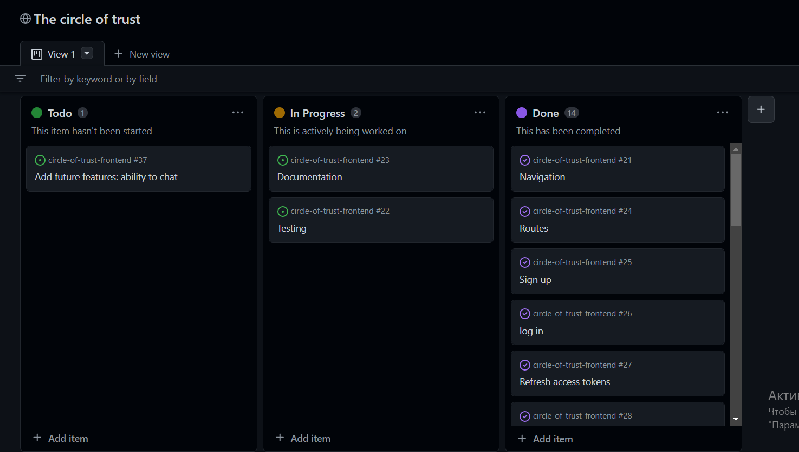

## CIRCLE OF TRUST (frontend)

---

- [The circle of Trust (frontend)](https://circle-of-trust-frontend.herokuapp.com/)
- [The circle of Trust (Backend)](https://circle-of-trust.herokuapp.com/)

### Circle of trust is a website, inspired by the movie "Meet the Fockers", for using by the trusted circle of people: family, friends, co-workers etc.This app helps to share memos and tasks in a secure and private environment. It is perfect for people who want to stay connected and organized. Instead of stickers, pinned to the fridge/whiteboard, or groupchats in whatsapp, you can use this app. 

## Project goals
The primary goals of the web app are to:
1) Provide busy families with a single, central hub around which to plan and organise busy schedules, ability to stay in touch with each other even long distance. This should include scheduling functionality similar to a family wall planner, sharing memos, viewed by all the members of the Circle.
2) Deliver a simple and intuitive user experience, suitable for all ages. 
3) Offer a minimal set of impactful features chosen in order to deliver a useful and entertaining app within an achievable development timeframe, while laying a foundation for additional features in the future.

## User Experience (UX) and Agile method

GitHub issues and projects were used to document and track an agile development approach.
A GitHub issue was created for each user story. 

A project kanban board was used to track progress, with user stories moved between 'Todo', 'In Progress' and 'Done' columns.

## Data models
Data models are documented in the read-me for the [Circle of Trust Django Rest Framework API](https://github.com/annatolchynska/circle-of-trust-drf).

## Design

### Colors
The primary design aim was to create a simple,entertaining and functional appearance: simple colour theming feature. This approach was ideally suited to the desire for a clean and simple site.

A gray background was chosen for the site's main theme to provide a clean, straighforward and uncluttered look.

The main colour palettes used for light and dark modes are:

| Colour |Light mode value   |Dark mode value   |   |   |
|---|---|---|---|---|
|  Primary - used for logo and key UI elements |  #e5006a |  #add5f7 |   |   |
| Secondary - used for logo, notifications badge and calendar highlighting  | #9c13bf  |  #e6e6e6 |   |   |
|  Accent - used for section/page headings |  #215ba6 | #d8ebf2  |   |   |
|  Neutral - used for sub-headings |   #4a4a4a |  #ffffff |   |   |
|  Base-100 - main background colour |  #fbfbfb |  #1c1c1c |   |   |
|  Base-200 - darker background colour |  #f8f8f8 | #141414  |   |   |
|  Base-300 - second darker background colour |  #d6d6d6 | #141414  |   |   |